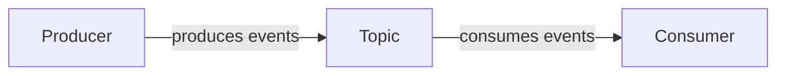

# kafka-python-fa-lab-m02w01

# Lab for Month 02 Week 01

- [Lab for Month 02 Week 01](#lab-for-month-02-week-01)
  - [96. Prerequisites](#96-prerequisites)
  - [0. 📂 Create Project](#0--create-project)
  - [1. 🚀 Kafka Setup](#1--kafka-setup)
  - [2. 📦 Create Topic](#2--create-topic)
  - [3. 🔨 Build Producer](#3--build-producer)
  - [4. 🔧 Build Consumer](#4--build-consumer)
  - [5. ⚡ Produce Events](#5--produce-events)
  - [6. 📥 Consume Events](#6--consume-events)
  - [69. 🎯 Where next?](#69--where-next)

In this tutorial, you will build a very simple Python client application which produces and consumes messages from an Apache Kafka® cluster, locally using Confluent Community version.



## 96. Prerequisites

- You already have `Python 3.10+` installed
- Familiar with using `venv`
- Install Java SDK ([download](https://www.oracle.com/pk/java/technologies/downloads/))
- _Optional_, familiar with [Confluent CLI - local](https://docs.confluent.io/confluent-cli/current/command-reference/local/index.html#confluent-local)

> [!IMPORTANT]
> In this lab, we'll run Kafka in the usual terminal via the Confluent CLI.
> </br>
> You can also run Kafka in Docker as an alternative. This requires:
> - Docker environment setup ([installation guide](/setup/install_n_start_docker.md))
> - Verify Docker installation with `docker info`
>
> We highly recommend trying the Docker setup if time permits - see our [Docker Kafka playground guide](../setup/play_kafka_in_docker.md)

## 0. 📂 Create Project

- Create new GitHub repository ([guide](https://github.com/foundry-ai-academy/fa-c001-m01w01l03/blob/e023f49cbf2aa04967196be1b15b8b92a4ecfa77/setup/1_setup_github_repo.md)), named `kafka-python-fa-lab-m02w01`

> [!TIP]
> Remeber to select `.gitignore` for Python

- In VSCode terminal, clone the above repository and set the current working directory (CWD):

  ```sh
  git clone https://github.com/{your-username}/kafka-python-fa-lab-m02w01.git
  cd kafka-python-fa-lab-m02w01
  ```

- Activate the virtual environment and install the dependencies:

  - _Windows_

    ```powershell
    # Create virtual environment
    python -m venv .env

    # Activate virtual environment
    .env\Scripts\activate.ps1

    # Install kafka client
    pip install confluent-kafka
    ```

  - _macOS/Linux_

    ```bash
    # Create virtual environment
    python3 -m venv .env

    # Activate virtual environment
    source .env/bin/activate

    # Install kafka client
    pip install confluent-kafka
    ```

> [!NOTE]
> This lab was last tested using version 2.9.0 of the client.

## 1. 🚀 Kafka Setup

We are going to need a Kafka Cluster for our client application to operate with.

Install the Confluent CLI if you don't already have it.

> [!TIP]
> You can use a [different installation method](https://docs.confluent.io/confluent-cli/current/install.html).

In your terminal, download and unzip the downloaded Confluent Community package:

```sh
curl -O https://packages.confluent.io/archive/7.9/confluent-community-7.9.0.zip
unzip confluent-community-7.9.0.zip
```

> [!NOTE]
> - This lab was tested with 7.9.0 community version, check the latest one at [Confluent Packages](https://packages.confluent.io/archive)
> - For Windows user, let's just do it OUTSIDE of the terminal

You must export the path as an environment variable for each terminal session (1), or set the path in your shell profile (2). For example of (1):

```sh
# bash
export CONFLUENT_HOME="./confluent-7.9.0" # directory where Confluent Community is installed (or extracted)
export PATH=$PATH:$CONFLUENT_HOME/bin # add bin to PATH

# powershell
$env:CONFLUENT_HOME="./confluent-7.9.0" # directory where Confluent Community is installed (or extracted)
$env:PATH="$env:CONFLUENT_HOME\bin;$env:PATH" # add bin to PATH
```

> [!NOTE]
> Remember to add `confluent-*.zip` and `confluent-*` to `.gitignore` file if you download and extract the Confluent package at the repository dir

Verify by checking the version:

```sh
confluent local version
# Confluent Community Software: 7.9.0
```

> [!TIP]
> 🐞 You get this error: `Error: set environment variable CONFLUENT_HOME`
> </br>
> ✅ Voilà! You missed the step of exporting environment variables in the `Kafka Setup` section

Now start the Kafka broker (with the associated service(s)):

```sh
confluent local services kafka start
# Using CONFLUENT_CURRENT: /var/folders/9_/p5ybsyls06xcsgfdlfjrf2bh0000gn/T/confluent.336466
# Starting ZooKeeper
# ZooKeeper is [UP]
# Starting Kafka
# Kafka is [UP]
```

> [!TIP]
> - Try to run `confluent local kafka start` and get the _error_, this is another style of CLI command which is dedicated to use within Docker environment
> - To stop the service, simply run `confluent local services kafka stop`
> - To start/stop all services, simply run `confluent local services start/stop`

## 2. 📦 Create Topic

A topic is an immutable, append-only log of events. Usually, a topic is comprised of the same kind of events, e.g., in this guide we create a topic for _retail purchases_.

Create a new topic, _purchases_, which you will use to produce and consume events.

```sh
confluent local services kafka produce purchase
# Exit with Ctrl-D
# >
```

## 3. 🔨 Build Producer

> Check the [Documentation](https://docs.confluent.io/platform/current/clients/producer.html)

Let's create the Python producer application by pasting the following code into a file `producer.py`.

> [!NOTE]
> This script will automatically create the Topic if not exists

```python
#!/usr/bin/env python

from random import choice
from confluent_kafka import Producer

TOPIC = "purchase"

if __name__ == '__main__':

    config = {
        # User-specific properties that you must set
        'bootstrap.servers': 'localhost:<PORTS>',

        # Fixed properties
        'acks': 'all'
    }
    # See all configs at: https://docs.confluent.io/platform/current/installation/configuration/producer-configs.html

    # Create Producer instance
    producer = Producer(config)

    # Optional per-message delivery callback (triggered by poll() or flush())
    # when a message has been successfully delivered or permanently
    # failed delivery (after retries).
    def delivery_callback(err, msg):
        if err:
            print('ERROR: Message failed delivery: {}'.format(err))
        else:
            print("Produced event to topic {topic}: key = {key:12} value = {value:12}".format(
                topic=msg.topic(), key=msg.key().decode('utf-8'), value=msg.value().decode('utf-8')))

    # Produce data by selecting random values from these lists.
    user_ids = ['eabara', 'jsmith', 'sgarcia', 'jbernard', 'htanaka', 'awalther']
    products = ['book', 'alarm clock', 't-shirts', 'gift card', 'batteries']

    count = 0
    for _ in range(10):
        user_id = choice(user_ids)
        product = choice(products)
        producer.produce(TOPIC, product, user_id, callback=delivery_callback)
        count += 1

    # Block until the messages are sent.
    producer.poll(10000)
    producer.flush()
```

Fill in the appropriate `bootstrap.servers` value and any additional security configuration needed inline where the client configuration `config` object is created.

> [!NOTE]
> Calm down! We will run the script in the Step 5 💃

## 4. 🔧 Build Consumer

> Check the [Documentation](https://docs.confluent.io/platform/current/clients/consumer.html)

Next, create the Python consumer application by pasting the following code into a file `consumer.py`.

```python
#!/usr/bin/env python

from confluent_kafka import Consumer

TOPIC = "purchase"

if __name__ == '__main__':

    config = {
        # User-specific properties that you must set
        'bootstrap.servers': 'localhost:<PLAINTEXT PORTS>',

        # Fixed properties
        'group.id':          'kafka-python-fa-lab-m02w01',
        'auto.offset.reset': 'earliest'
    }
    # See all configs at: https://docs.confluent.io/platform/current/installation/configuration/consumer-configs.html

    # Create Consumer instance
    consumer = Consumer(config)

    # Subscribe to topic
    consumer.subscribe([TOPIC])

    # Poll for new messages from Kafka and print them.
    try:
        while True:
            msg = consumer.poll(1.0)
            if msg is None:
                # Initial message consumption may take up to
                # `session.timeout.ms` for the consumer group to
                # rebalance and start consuming
                print("Waiting...")
            elif msg.error():
                print("ERROR: %s".format(msg.error()))
            else:
                # Extract the (optional) key and value, and print.
                print("Consumed event from topic {topic}: key = {key:12} value = {value:12}".format(
                    topic=msg.topic(), key=msg.key().decode('utf-8'), value=msg.value().decode('utf-8')))
    except KeyboardInterrupt:
        pass
    finally:
        # Leave group and commit final offsets
        consumer.close()
```

Again, fill in the appropriate `bootstrap.servers` value and any additional security configuration needed inline where the client configuration `config` object is created.

> [!NOTE]
> Calm down! We will run the script in the Step 6 💃

## 5. ⚡ Produce Events

Open another termial, try to run the script:

```sh
python producer.py
```

You should see output resembling this:

```plaintext
Produced event to topic purchases: key = jsmith     value = batteries
Produced event to topic purchases: key = jsmith     value = book
Produced event to topic purchases: key = jbernard   value = book
Produced event to topic purchases: key = eabara     value = alarm clock
Produced event to topic purchases: key = htanaka    value = t-shirts
Produced event to topic purchases: key = jsmith     value = book
Produced event to topic purchases: key = jbernard   value = book
Produced event to topic purchases: key = awalther   value = batteries
Produced event to topic purchases: key = eabara     value = alarm clock
Produced event to topic purchases: key = htanaka    value = batteries
```

## 6. 📥 Consume Events

Open another termial, try to run the script:

```sh
python consumer.py
```

You should see output resembling this:

```plaintext
Consumed event from topic purchases: key = sgarcia    value = t-shirts
Consumed event from topic purchases: key = htanaka    value = alarm clock
Consumed event from topic purchases: key = awalther   value = book
Consumed event from topic purchases: key = sgarcia    value = gift card
Consumed event from topic purchases: key = eabara     value = t-shirts
Consumed event from topic purchases: key = eabara     value = t-shirts
Consumed event from topic purchases: key = jsmith     value = t-shirts
Consumed event from topic purchases: key = htanaka    value = batteries
Consumed event from topic purchases: key = htanaka    value = book
Consumed event from topic purchases: key = sgarcia    value = book
Waiting...
Waiting...
Waiting...
```

Rerun the producer to see more events, or feel free to modify the code as necessary to create more or different events:


Once you are done with the consumer, enter `Ctrl-C` to terminate the consumer application.

Shut down Kafka when you are done with it:

```sh
confluent local services kafka stop
```

And exit the virtual environment:

```sh
deactivate
```

## 69. 🎯 Where next?

READ more simple code:

- [examples/avro_producer.py](https://github.com/confluentinc/confluent-kafka-python/blob/master/examples/avro_producer.py)
- [examples/avro_consumer.py](https://github.com/confluentinc/confluent-kafka-python/blob/master/examples/avro_consumer.py)
- [examples/protobuf_producer.py](https://github.com/confluentinc/confluent-kafka-python/blob/master/examples/protobuf_producer.py)
- [examples/protobuf_consumer.py](https://github.com/confluentinc/confluent-kafka-python/blob/master/examples/protobuf_consumer.py)
- [examples/json_producer.py](https://github.com/confluentinc/confluent-kafka-python/blob/master/examples/json_producer.py)
- [examples/json_consumer.py](https://github.com/confluentinc/confluent-kafka-python/blob/master/examples/json_consumer.py)

Go beyond simple python apps:

- [Event-Driven Microservices with Python and Apache Kafka](https://www.confluent.io/blog/event-driven-microservices-with-python-and-kafka/)
- [Integrating Apache Kafka With Python Asyncio Web Applications](https://www.confluent.io/ko-kr/blog/kafka-python-asyncio-integration/)
- [Machine Learning with Python, Jupyter, KSQL and TensorFlow](https://www.confluent.io/ko-kr/blog/machine-learning-with-python-jupyter-ksql-tensorflow/)
- [We ❤ syslogs: Real-time syslog Processing with Apache Kafka and KSQL – Part 2: Event-Driven Alerting with Slack](https://www.confluent.io/blog/real-time-syslog-processing-with-apache-kafka-and-ksql-part-2-event-driven-alerting-with-slack/)
  
For the Python client API, check out the [confluent_kafka documentation](https://docs.confluent.io/platform/current/clients/confluent-kafka-python/html/index.html).

For information on testing in the Kafka ecosystem, check out [Testing Event Streaming Apps](https://developer.confluent.io/learn/testing-kafka).
If you're interested in using streaming SQL for data creation, processing, and querying in your applications, check out the [ksqlDB 101](https://developer.confluent.io/learn-kafka/ksqldb/intro/) course.
Interested in performance tuning of your event streaming applications? Check out the [Kafka Performance resources](https://developer.confluent.io/learn/kafka-performance/).

For the Snowflake Users, check out the Snowflake Connector for Kafka's [user guide](https://docs.snowflake.com/en/user-guide/kafka-connector)

> [!IMPORTANT]
> It is highly recommended to try the Snowflake Connector 💯
